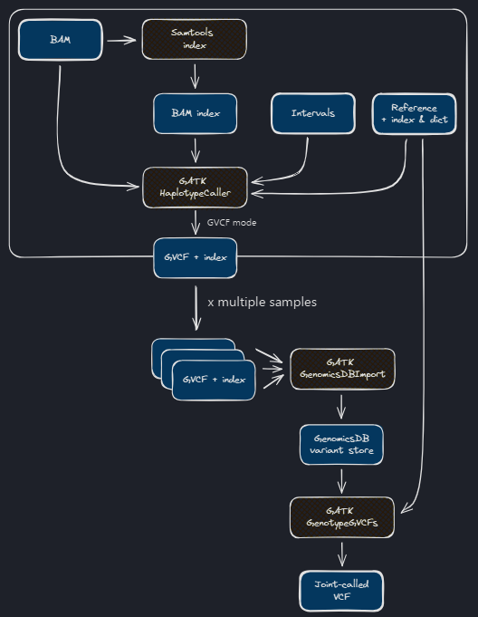

# Nextflow for Genomics

Problem Statement: To implement a simple indexing with SAMTOOLS and variant calling pipeline with GATK (Genome Analysis Toolkit)  

NOTE: This pipeline was created as a part of the training provided by [Nextflow](https://training.nextflow.io/latest/nf4_science/genomics/)

# High Level Architecture Diagram
<p align="center">
  
</p>

# Requirements
- Linux
- Nextflow

# Install the dependencies 
We are using docker to run our pipeline and hence we require the images of the tools we want to use.

- Samtools
  ```bash
  docker pull community.wave.seqera.io/library/samtools:1.20--b5dfbd93de237464
  ```
- GATK 
  ```bash
  docker pull community.wave.seqera.io/library/gatk4:4.5.0.0--730ee8817e436867
  ```

# Run the pipeline
```bash
nextflow run pipeline.nf
```

# Thank You
